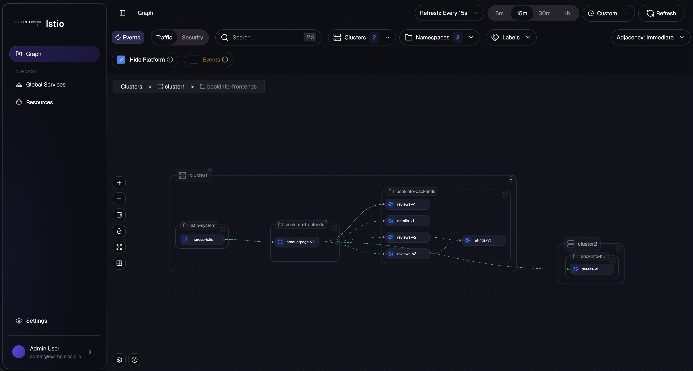
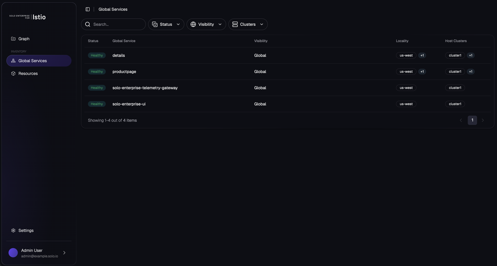
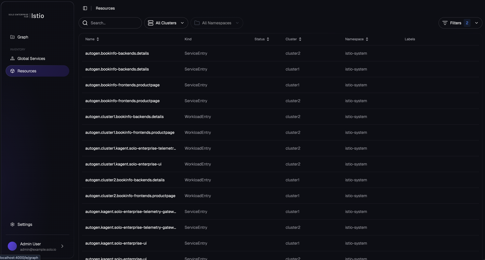

# Install the Solo Management UI on OpenShift

# Objectives
- Install the Solo Management UI on `cluster1` with the mesh product view
- Install the Solo Enterprise relay on `cluster2` to tunnel telemetry back to the management UI through Istio Ambient
- Configure an OpenShift Route to expose the Solo UI
- Access the Solo Management UI to inspect the multi-cluster mesh







## Prerequisites
- This lab assumes you have completed setup from labs `000-006`. Lab `006` is load-bearing — the relay reaches the management UI via the `*.mesh.internal` cross-cluster hostnames configured there.

> **Run the cleanup in lab `007` or `008` before starting this lab.** Segments replace the
> `*.mesh.internal` hostnames with the segment domain (`mesh.acme` / `mesh.acquired`), including this
> lab's `solo-enterprise-tunnel.kagent.mesh.internal`. With a segment label still on `istio-system`, the
> relay cannot resolve the management tunnel, and its `solo-enterprise-tunnel-client` pod restarts every two seconds
> with `dial tcp: lookup solo-enterprise-tunnel.kagent.mesh.internal ... no such host`. Confirm you are back
> on a flat mesh before continuing:
>
> ```bash
> kubectl get ns istio-system --context $KUBECONTEXT_CLUSTER1 -o jsonpath='{.metadata.labels.admin\.solo\.io/segment}{"\n"}'
> kubectl get ns istio-system --context $KUBECONTEXT_CLUSTER2 -o jsonpath='{.metadata.labels.admin\.solo\.io/segment}{"\n"}'
> ```
>
> Both should print an empty line. If either prints a segment name, run the cleanup section of lab `008`
> (or lab `007` if you skipped `008`) before proceeding.

## Set environment variables

```bash
export SOLO_MANAGEMENT_UI_VERSION=0.5.8
export SOLO_MANAGEMENT_UI_OCI_REPO=us-docker.pkg.dev/solo-public/solo-enterprise-helm

export KUBECONTEXT_CLUSTER1=cluster1  # Replace with your actual kubectl context name
export KUBECONTEXT_CLUSTER2=cluster2  # Replace with your actual kubectl context name

# Mesh names from labs 002/003. These must match global.multiCluster.clusterName, not the kubecontext.
# On KinD the context is "kind-cluster1" while the mesh name is "cluster1". The UI correlates its
# telemetry against the mesh name Istio reports in source_cluster and destination_cluster.
export MESH_NAME_CLUSTER1=cluster1
export MESH_NAME_CLUSTER2=cluster2
```

This lab assumes `SOLO_TRIAL_LICENSE_KEY` is already exported from earlier in the workshop.

## OpenShift SCC for ClickHouse

The chart's ClickHouse statefulset runs as UID/GID `101` (the upstream `clickhouse/clickhouse-server` image's `clickhouse` user). OpenShift's default `restricted-v2` SCC rejects this — UIDs must fall in the namespace's auto-assigned range (e.g. `1000760000-1000769999`). Without an `anyuid` binding, the ClickHouse pod is never created (admission denies the statefulset's pod template):
```
provider restricted-v2: .spec.securityContext.fsGroup: Invalid value: []int64{101}: 101 is not an allowed group
provider restricted-v2: .containers[0].runAsUser: Invalid value: 101: must be in the ranges: [1000760000, 1000769999]
```

Pre-grant `anyuid` to the ClickHouse service account on cluster1 (the SCC binding can reference a service account before it exists):
```bash
kubectl create namespace kagent --context $KUBECONTEXT_CLUSTER1 2>/dev/null || true
oc --context $KUBECONTEXT_CLUSTER1 adm policy add-scc-to-user anyuid -z management-clickhouse -n kagent
```

> **Why this is needed:** The other workloads in the chart (`solo-enterprise-ui`, `solo-enterprise-tunnel`, `solo-enterprise-k8sobjects-collector`, `solo-enterprise-telemetry-collector`) already set `runAsNonRoot: true` with no hardcoded UID, so OpenShift can auto-assign a UID and they run cleanly under `restricted-v2`. Only ClickHouse hardcodes UID `101`. The relay chart installed on cluster2 below has no equivalent issue — no additional SCC binding is required there.

## Install the Solo Management UI on cluster1

Install the `management` chart. This installs ClickHouse (telemetry storage), the Solo Enterprise telemetry collector, and the Solo Enterprise UI with the **mesh** product view enabled. The chart enables Istio ambient integration by default — it automatically labels its own pods with `istio.io/dataplane-mode=ambient` and labels the `solo-enterprise-ui`, `solo-enterprise-tunnel`, and `solo-enterprise-telemetry-gateway` services with `solo.io/service-scope=global`, so the workload cluster's relay can reach them over the ambient mesh via `*.mesh.internal`.

> **OpenShift ambient probes:** With ambient enrollment, kubelet readiness/liveness probes are SNAT-rewritten in the host netns by istio-cni. This only works when OVN-Kubernetes is running in **local gateway mode** (`routingViaHost: true`) — see the OpenShift prerequisite in [002-install-istio-on-cluster1.md](002-install-istio-on-cluster1.md#openshift-platform-prerequisite-ovn-kubernetes-local-gateway-mode). On a default OpenShift install (shared gateway mode), the chart's pods will CrashLoop on liveness because every probe times out.

> **Private registry users:** Each component below includes a commented-out `image` override block. Uncomment and update the `registry`, `repository`, and `tag` fields to point to your private registry before running this command. For most users a single `global.image` override is sufficient — the per-component blocks are provided for finer-grained control.

```bash
helm upgrade --install management \
  oci://${SOLO_MANAGEMENT_UI_OCI_REPO}/charts/management \
  --version ${SOLO_MANAGEMENT_UI_VERSION} \
  --namespace kagent \
  --create-namespace \
  --kube-context $KUBECONTEXT_CLUSTER1 \
  --no-hooks \
  -f -<<EOF
cluster: "${MESH_NAME_CLUSTER1}"
# override (global fallback for all solo-owned images)
#global:
#  image:
#    registry: us-docker.pkg.dev/solo-public
#    repository: solo-enterprise
#    tag: ${SOLO_MANAGEMENT_UI_VERSION}
service:
  type: ClusterIP
products:
  kagent:
    enabled: false
  agentgateway:
    enabled: false
  mesh:
    enabled: true
  agentregistry:
    enabled: false
licensing:
  licenseKey: "${SOLO_TRIAL_LICENSE_KEY}"
# Reduce ClickHouse resource requests below chart defaults (2 CPU / 3Gi memory) so the pod schedules on small workshop clusters.
# Remove this block for production deployments. The chart defaults are sized for real telemetry volume.
clickhouse:
  resources:
    requests:
      cpu: 500m
      memory: 1Gi
      ephemeral-storage: 50Mi
    limits:
      cpu: 2
      memory: 4Gi
# override (tunnel server image)
#tunnelserver:
#  registry: us-docker.pkg.dev/solo-public
#  repository: solo-enterprise
#  name: solo-enterprise-tunnel-server
#  tag: ${SOLO_MANAGEMENT_UI_VERSION}
# override (UI images)
#ui:
#  backend:
#    registry: us-docker.pkg.dev/solo-public
#    repository: solo-enterprise
#    name: solo-enterprise-ui-backend
#  frontend:
#    registry: us-docker.pkg.dev/solo-public
#    repository: solo-enterprise
#    name: solo-enterprise-ui-frontend
# override (telemetry collector image)
#telemetry:
#  image:
#    registry: docker.io
#    repository: otel
#    name: opentelemetry-collector-contrib
#    tag: 0.158.0
EOF
```

Wait for the management workloads to be ready:

```bash
kubectl rollout status statefulset/management-clickhouse-shard0 \
  -n kagent --context $KUBECONTEXT_CLUSTER1 --timeout=300s
kubectl rollout status statefulset/solo-enterprise-telemetry-collector \
  -n kagent --context $KUBECONTEXT_CLUSTER1 --timeout=300s
kubectl rollout status deployment/solo-enterprise-ui \
  -n kagent --context $KUBECONTEXT_CLUSTER1 --timeout=300s
kubectl rollout status deployment/solo-enterprise-tunnel \
  -n kagent --context $KUBECONTEXT_CLUSTER1 --timeout=300s
kubectl rollout status deployment/solo-enterprise-k8sobjects-collector \
  -n kagent --context $KUBECONTEXT_CLUSTER1 --timeout=300s
```

Verify the pods on cluster1:

```bash
kubectl get pods -n kagent --context $KUBECONTEXT_CLUSTER1
```

The output should look similar to:

```
NAME                                                    READY   STATUS    RESTARTS   AGE
management-clickhouse-shard0-0                          1/1     Running   0          90s
solo-enterprise-k8sobjects-collector-6d9f7b8c5-x2k4p    1/1     Running   0          90s
solo-enterprise-telemetry-collector-0                   1/1     Running   0          90s
solo-enterprise-tunnel-5b8c9d7f6-q7m2n                  1/1     Running   0          90s
solo-enterprise-ui-7c5f8d6b4d-abc12                     1/1     Running   0          90s
```

Confirm the chart auto-applied the cross-cluster service labels — the relay on cluster2 relies on these:

```bash
kubectl get svc solo-enterprise-ui solo-enterprise-tunnel solo-enterprise-telemetry-gateway \
  -n kagent --context $KUBECONTEXT_CLUSTER1 \
  -o jsonpath='{range .items[*]}{.metadata.name}{"\t"}{.metadata.labels.solo\.io/service-scope}{"\n"}{end}'
```

All three services should report `global`.

## Expose the Solo UI through an OpenShift Route

Expose the `solo-enterprise-ui` service via an edge-terminated Route so the UI is reachable from outside the cluster:

```bash
kubectl apply --context $KUBECONTEXT_CLUSTER1 -f - <<EOF
kind: Route
apiVersion: route.openshift.io/v1
metadata:
  name: solo-enterprise-ui
  namespace: kagent
spec:
  subdomain: solo-enterprise-ui
  to:
    kind: Service
    name: solo-enterprise-ui
    weight: 100
  port:
    targetPort: http
  tls:
    termination: edge
    insecureEdgeTerminationPolicy: Redirect
  wildcardPolicy: None
EOF
```

Get the public URL (it may take a moment before the UI is reachable through the Route):

```bash
export SOLO_UI_ADDRESS=$(oc get route solo-enterprise-ui -n kagent --context $KUBECONTEXT_CLUSTER1 \
  -o jsonpath='{.status.ingress[0].host}')

echo https://$SOLO_UI_ADDRESS
```

Note: only the UI needs an external endpoint. The legacy lab created additional Routes for the management server and telemetry gateway; those are **not** needed here because the relay reaches the UI internally via the ambient mesh's cross-cluster `*.mesh.internal` DNS.

## Install the Solo Enterprise relay on cluster2

The relay is a small workload that runs on every cluster *other than* the management cluster. It forwards telemetry from the workload cluster back to the management cluster's UI through the ambient mesh — no LoadBalancer, no relay tokens, and no Routes required.

> **Private registry users:** Uncomment the override block below and point it at your private registry before running.

```bash
helm upgrade --install relay \
  oci://${SOLO_MANAGEMENT_UI_OCI_REPO}/charts/relay \
  --version ${SOLO_MANAGEMENT_UI_VERSION} \
  --namespace solo-enterprise \
  --create-namespace \
  --kube-context $KUBECONTEXT_CLUSTER2 \
  -f -<<EOF
cluster: "${MESH_NAME_CLUSTER2}"
products:
  mesh:
    enabled: true
# override (global fallback for all solo-owned images)
#global:
#  image:
#    registry: us-docker.pkg.dev/solo-public
#    repository: solo-enterprise
#    tag: ${SOLO_MANAGEMENT_UI_VERSION}
tunnel:
  fqdn: solo-enterprise-tunnel.kagent.mesh.internal
  port: 9000
telemetry:
  fqdn: solo-enterprise-telemetry-gateway.kagent.mesh.internal
# override (telemetry collector image)
#  image:
#    registry: docker.io
#    repository: otel
#    name: opentelemetry-collector-contrib
#    tag: 0.158.0
EOF
```

Wait for the relay rollout:

```bash
kubectl rollout status deployment/solo-enterprise-relay \
  -n solo-enterprise --context $KUBECONTEXT_CLUSTER2 --timeout=180s
kubectl rollout status deployment/solo-enterprise-tunnel-client \
  -n solo-enterprise --context $KUBECONTEXT_CLUSTER2 --timeout=180s
```

> **Expect IPv6 connection warnings in the relay logs on IPv4-only clusters.** Istio auto-allocates both
> an IPv4 and an IPv6 address for each `*.mesh.internal` hostname. The collector tries the IPv6 one first
> and logs this every couple of seconds:
>
> ```
> grpc: addrConn.createTransport failed to connect to {Addr: "[2001:2::2]:4316",
>   ServerName: "solo-enterprise-telemetry-gateway.kagent.mesh.internal:4316"}
>   Err: dial tcp [2001:2::2]:4316: connect: network is unreachable
> ```
>
> gRPC retries over IPv4 and telemetry arrives, so the warnings are noise rather than a failure. Confirm
> the data is flowing instead of reading the log:
>
> ```bash
> kubectl exec -n kagent management-clickhouse-shard0-0 --context $KUBECONTEXT_CLUSTER1 -- \
>   clickhouse-client --query "SELECT ResourceAttributes['cluster_name'] AS c, count() FROM platformdb.otel_metrics_sum GROUP BY c"
> ```
>
> Both cluster names should appear with a non-zero count. Allow a minute after the relay starts.

## Access the Solo Management UI

Using the OpenShift Route:

```bash
export SOLO_UI_ADDRESS=$(oc get route solo-enterprise-ui -n kagent --context $KUBECONTEXT_CLUSTER1 \
  -o jsonpath='{.status.ingress[0].host}')

echo https://$SOLO_UI_ADDRESS
```

Or via port-forward:

```bash
kubectl port-forward svc/solo-enterprise-ui -n kagent 8090:80 --context $KUBECONTEXT_CLUSTER1
```

Then navigate to `http://localhost:8090`. The Mesh view should show both `cluster1` and `cluster2` along with the bookinfo workloads from earlier labs.

# Uninstall

```bash
kubectl delete route solo-enterprise-ui -n kagent --context $KUBECONTEXT_CLUSTER1

helm uninstall relay -n solo-enterprise --kube-context $KUBECONTEXT_CLUSTER2
helm uninstall management -n kagent --kube-context $KUBECONTEXT_CLUSTER1

kubectl delete ns solo-enterprise --context $KUBECONTEXT_CLUSTER2
kubectl delete ns kagent --context $KUBECONTEXT_CLUSTER1
```

## Congratulations!

You have completed the workshop! You have successfully:
- Deployed the bookinfo application across two clusters
- Installed Istio Ambient Mesh on both clusters
- Enrolled workloads into the mesh and validated mTLS with ztunnel
- Exposed the bookinfo application via an Ingress Gateway
- Configured multicluster connectivity and failover
- Isolated namespaces across clusters with Segments
- Enforced zero-trust access control policies
- Configured egress with a waypoint
- Installed the Solo Management UI for cross-cluster mesh visibility

If you would like to clean up all workshop resources, see `014` for cleanup instructions.
