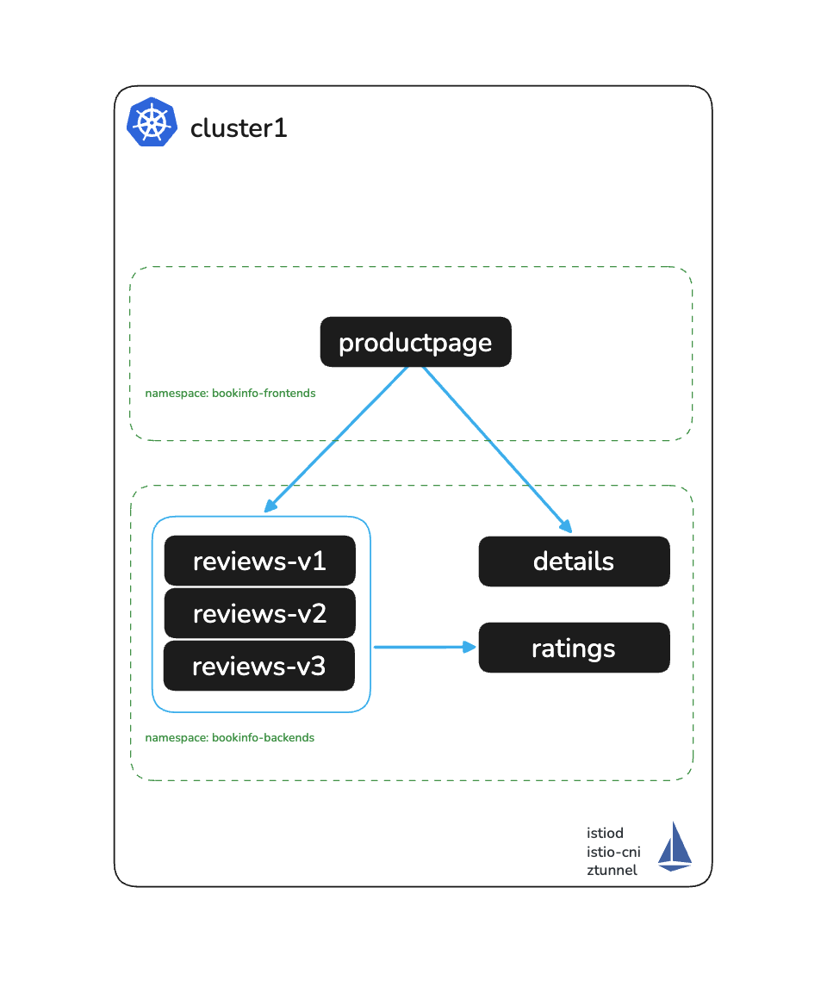

# Install Solo Istio Ambient

# Objectives
- Deploy Istio Ambient Mesh on a standard Kubernetes cluster with a Helm-based install
- Configure the cluster with multicluster-ready trust and network topology settings



## Prerequisites
- This lab assumes you have read through and completed any setup from the `000` labs

## Multicluster-ready design

Even though this is a single-cluster workshop, the install is intentionally configured to match what the multicluster workshop requires. This means you can extend to a second cluster later without reinstalling Istio or re-issuing certificates. The specific choices that enable this:

| Setting | Single-cluster effect | Why it matters for multicluster |
|---|---|---|
| `MESH_NAME_CLUSTER1=cluster1` for mesh identity | Names the cluster in mesh config | Multicluster uses `cluster1`/`cluster2` as distinct identities |
| `topology.istio.io/network` label | Tags the network identity | Required for cross-cluster HBONE routing |
| Per-cluster trust domain (`$MESH_NAME_CLUSTER1.local`) | Non-default trust domain | Avoids trust domain collision when adding cluster2 |
| Shared root CA (`cacerts` secret) | Custom cert hierarchy | Allows both clusters to share a root of trust |
| `PILOT_SKIP_VALIDATE_TRUST_DOMAIN` | No-op with one cluster | Required when clusters have distinct trust domains |
| `platforms.peering.enabled: true` | Enables Solo peering API | Required for `istioctl multicluster link` in multicluster |
| `network: $MESH_NAME_CLUSTER1` on ztunnel | No-op with one cluster | Required for cross-network HBONE routing |

## Set environment variables

```bash
export KUBECONTEXT_CLUSTER1=cluster1  # Replace with your actual kubectl context name
export MESH_NAME_CLUSTER1=cluster1    # Recommended to keep as cluster1 for POC
```

> **KinD users:** KinD automatically prefixes kubecontext names with `kind-`. You can set `KUBECONTEXT_CLUSTER1=kind-<cluster-name>` but keep `MESH_NAME_CLUSTER1=<cluster-name>` (without the `kind-` prefix). The `MESH_NAME_CLUSTER1` value is the Istio network name — it must match the `topology.istio.io/network` label on the `istio-system` namespace and the ztunnel `NETWORK` env var. Mismatching these causes ztunnel to fail VIP lookups, silently bypassing waypoints.

Export your Solo.io license key and Istio version:
```bash
export SOLO_TRIAL_LICENSE_KEY=<paste-your-key>
[ -n "$SOLO_TRIAL_LICENSE_KEY" ] || echo "⚠️  SOLO_TRIAL_LICENSE_KEY is not set. Istio installs with an empty license and enterprise features, including multicluster peering, then fail."
export ISTIO_VERSION=1.30.2
```

## Install Solo `istioctl`

```bash
OS=$(uname | tr '[:upper:]' '[:lower:]' | sed -E 's/darwin/osx/')
ARCH=$(uname -m | sed -E 's/aarch/arm/; s/x86_64/amd64/; s/armv7l/armv7/')

INSTALL_DIR="."
mkdir -p "$INSTALL_DIR"
ISTIOCTL_URL="https://storage.googleapis.com/soloio-istio-binaries/release/${ISTIO_VERSION}-solo/istioctl-${ISTIO_VERSION}-solo-${OS}-${ARCH}.tar.gz"
curl -sSL "$ISTIOCTL_URL" | tar xzf - -C "$INSTALL_DIR"
mv "${INSTALL_DIR}/istioctl" "${INSTALL_DIR}/solo-istioctl"
chmod +x "${INSTALL_DIR}/solo-istioctl"
```

Verify the binary:
```bash
./solo-istioctl version
```

## Generate a shared root CA (`cacerts` secret)

This step creates a self-signed root CA and loads it into Istio as a custom certificate hierarchy. On a single cluster this is optional — Istio will generate its own self-signed CA by default — but it is included here because:

- The multicluster workshop requires both clusters to share the same root CA so their workload certificates chain to the same trust anchor.
- If you skip this step now, adding a second cluster later requires re-issuing all certificates and rolling all workloads.

Generate the root CA and intermediate cert, then write them into a Kubernetes Secret manifest:
```bash
WORK_DIR=$(mktemp -d)

cat > "$WORK_DIR/root-openssl.cnf" <<'CNFEOF'
[ req ]
prompt = no
distinguished_name = dn
x509_extensions = v3_ca

[ dn ]
C  = US
ST = California
L  = San Francisco
O  = MyOrg
OU = MyUnit
CN = root-cert

[ v3_ca ]
basicConstraints = critical, CA:TRUE, pathlen:1
keyUsage = critical, keyCertSign, cRLSign
subjectKeyIdentifier = hash
CNFEOF

cat > "$WORK_DIR/intermediate-req.cnf" <<'CNFEOF'
[ req ]
prompt = no
distinguished_name = dn

[ dn ]
C  = US
ST = California
L  = San Francisco
O  = MyOrg
OU = MyUnit
CN = istio-intermediate-ca
CNFEOF

cat > "$WORK_DIR/ca-ext.cnf" <<'CNFEOF'
[v3_ca]
basicConstraints = critical, CA:TRUE, pathlen:0
keyUsage = critical, keyCertSign, cRLSign
subjectKeyIdentifier = hash
authorityKeyIdentifier = keyid,issuer
CNFEOF

openssl req -x509 -sha256 -nodes -days 3650 \
  -newkey rsa:2048 \
  -keyout "$WORK_DIR/root-key.pem" \
  -out "$WORK_DIR/root-cert.pem" \
  -config "$WORK_DIR/root-openssl.cnf" \
  -extensions v3_ca

openssl req -new -nodes -newkey rsa:2048 \
  -keyout "$WORK_DIR/ca-key.pem" \
  -out "$WORK_DIR/ca.csr" \
  -config "$WORK_DIR/intermediate-req.cnf"

openssl x509 -req -sha256 -days 3650 \
  -in "$WORK_DIR/ca.csr" \
  -CA "$WORK_DIR/root-cert.pem" \
  -CAkey "$WORK_DIR/root-key.pem" \
  -CAcreateserial \
  -out "$WORK_DIR/ca-cert.pem" \
  -extfile "$WORK_DIR/ca-ext.cnf" \
  -extensions v3_ca

cat "$WORK_DIR/ca-cert.pem" "$WORK_DIR/root-cert.pem" > "$WORK_DIR/cert-chain.pem"

cat <<EOF > shared-root-trust-secret.yaml
apiVersion: v1
kind: Secret
metadata:
  name: cacerts
  namespace: istio-system
type: Opaque
data:
  ca-cert.pem: $(base64 < "$WORK_DIR/ca-cert.pem" | tr -d '\n')
  ca-key.pem: $(base64 < "$WORK_DIR/ca-key.pem" | tr -d '\n')
  cert-chain.pem: $(base64 < "$WORK_DIR/cert-chain.pem" | tr -d '\n')
  root-cert.pem: $(base64 < "$WORK_DIR/root-cert.pem" | tr -d '\n')
EOF

rm -rf "$WORK_DIR"
echo "Generated shared-root-trust-secret.yaml"
```

> **Keep this file.** When you add a second cluster in the multicluster workshop, you apply the same `shared-root-trust-secret.yaml` there so both clusters share the same root of trust.

## Create the `istio-system` namespace and apply the CA secret

```bash
kubectl create namespace istio-system --context $KUBECONTEXT_CLUSTER1 --dry-run=client -o yaml | kubectl apply --context $KUBECONTEXT_CLUSTER1 -f -
kubectl apply -f shared-root-trust-secret.yaml --context $KUBECONTEXT_CLUSTER1
```

Label the namespace with the network identity. This tag is how ztunnel and istiod know which network they belong to — required for cross-cluster HBONE routing in multicluster:
```bash
kubectl label namespace istio-system topology.istio.io/network=$MESH_NAME_CLUSTER1 --context $KUBECONTEXT_CLUSTER1
```

## Install Istio using Helm

Install `istio-base`:
```bash
helm upgrade --kube-context $KUBECONTEXT_CLUSTER1 --install istio-base \
  oci://us-docker.pkg.dev/soloio-img/istio-helm/base \
  -n istio-system \
  --version $ISTIO_VERSION-solo \
  --create-namespace
```

Install Kubernetes Gateway API CRDs if not already present:
```bash
kubectl get crd gateways.gateway.networking.k8s.io --context $KUBECONTEXT_CLUSTER1 &> /dev/null || \
  kubectl --context $KUBECONTEXT_CLUSTER1 apply -f https://github.com/kubernetes-sigs/gateway-api/releases/download/v1.5.0/standard-install.yaml
```

> **GKE only:** Pods with the `system-node-critical` priorityClassName can only be scheduled in namespaces that have a matching ResourceQuota. By default on GKE only `kube-system` has this quota. Run the following to allow `istio-cni` to be deployed in `istio-system`:
> ```bash
> kubectl apply -f gke/resourcequota.yaml --context $KUBECONTEXT_CLUSTER1
> ```

Install `istio-cni`:

> **GKE users:** Uncomment `platform: gke` under `global` in the values below before running this command.

```bash
helm upgrade --kube-context $KUBECONTEXT_CLUSTER1 --install istio-cni \
  oci://us-docker.pkg.dev/soloio-img/istio-helm/cni \
  -n istio-system \
  --version=$ISTIO_VERSION-solo \
  -f -<<EOF
profile: ambient
ambient:
  dnsCapture: true
excludeNamespaces:
  - istio-system
  - kube-system
global:
  # uncomment if using GKE
  #platform: gke
  hub: us-docker.pkg.dev/soloio-img/istio
  tag: $ISTIO_VERSION-solo
  variant: distroless
EOF
```

Wait for the CNI DaemonSet to roll out:
```bash
kubectl rollout status ds/istio-cni-node -n istio-system --watch --timeout=90s --context $KUBECONTEXT_CLUSTER1
```

Install `istiod`:
```bash
helm upgrade --kube-context $KUBECONTEXT_CLUSTER1 --install istiod \
  oci://us-docker.pkg.dev/soloio-img/istio-helm/istiod \
  -n istio-system \
  --version=$ISTIO_VERSION-solo \
  -f -<<EOF
profile: ambient
global:
  hub: us-docker.pkg.dev/soloio-img/istio
  tag: $ISTIO_VERSION-solo
  variant: distroless
  multiCluster:
    clusterName: $MESH_NAME_CLUSTER1
  # Tags this cluster's network — used for cross-cluster routing in multicluster
  network: $MESH_NAME_CLUSTER1
meshConfig:
  # Per-cluster trust domain avoids collision when a second cluster is added.
  # The multicluster workshop uses cluster1.local / cluster2.local.
  trustDomain: $MESH_NAME_CLUSTER1.local
env:
  # Enables assigning multi-cluster services an IP address
  PILOT_ENABLE_IP_AUTOALLOCATE: "true"
  # Lets Kubernetes Services select WorkloadEntries. Required for VM integration
  PILOT_ENABLE_K8S_SELECT_WORKLOAD_ENTRIES: "true"
  # Required when clusters have distinct trust domains (cluster1.local vs cluster2.local)
  PILOT_SKIP_VALIDATE_TRUST_DOMAIN: "true"
# Enables Solo's multicluster peering API, required by istioctl multicluster link
platforms:
  peering:
    enabled: true
license:
  value: $SOLO_TRIAL_LICENSE_KEY
EOF
```

Wait for istiod to roll out:
```bash
kubectl rollout status deploy/istiod -n istio-system --watch --timeout=90s --context $KUBECONTEXT_CLUSTER1
```

Install `ztunnel`:
```bash
helm upgrade --kube-context $KUBECONTEXT_CLUSTER1 --install ztunnel \
  oci://us-docker.pkg.dev/soloio-img/istio-helm/ztunnel \
  -n istio-system \
  --version=$ISTIO_VERSION-solo \
  -f -<<EOF
profile: ambient
logLevel: info
global:
  hub: us-docker.pkg.dev/soloio-img/istio
  tag: $ISTIO_VERSION-solo
  variant: distroless
resources:
  requests:
    cpu: 500m
    memory: 2048Mi
istioNamespace: istio-system
env:
  L7_ENABLED: "true"
  # Required when clusters have distinct trust domains
  SKIP_VALIDATE_TRUST_DOMAIN: "true"
# Must match the network set on istiod — used for cross-network HBONE routing
network: $MESH_NAME_CLUSTER1
multiCluster:
  clusterName: $MESH_NAME_CLUSTER1
EOF
```

Wait for ztunnel to roll out:
```bash
kubectl rollout status ds/ztunnel -n istio-system --watch --timeout=90s --context $KUBECONTEXT_CLUSTER1
```

## Validate the installation

Confirm all Istio components are running:
```bash
kubectl get pods -n istio-system --context $KUBECONTEXT_CLUSTER1
kubectl get ds ztunnel istio-cni-node -n istio-system --context $KUBECONTEXT_CLUSTER1
```

Expected output for `istio-system` pods:
```
NAME                      READY   STATUS    RESTARTS   AGE
istiod-5ccd964945-9kbjg   1/1     Running   0          2m
```

Expected output for `istio-system` DaemonSets:
```
NAME             DESIRED   CURRENT   READY   ...
ztunnel          3         3         3       ...
istio-cni-node   3         3         3       ...
```

## Next Steps
At this point we have completed the following objectives:
- Installed Solo Istio Ambient on a standard Kubernetes cluster using Helm
- Configured a per-cluster trust domain, network identity, and shared root CA — ready for multicluster extension
- Verified all Istio components (istiod, ztunnel, istio-cni) are running

In the next step `003` we will enroll the Bookinfo workloads in the Ambient Mesh.
