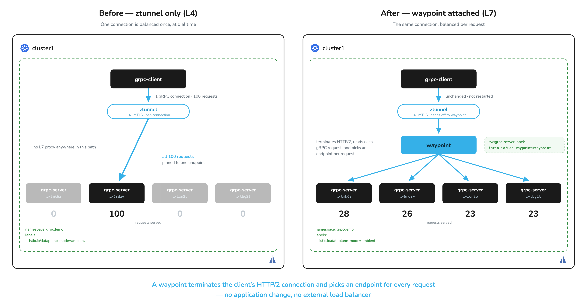

# gRPC Load Balancing with a Waypoint

# Objectives
- Reproduce gRPC connection pinning with a client and a 4-replica server
- Restore per-request load balancing by attaching a waypoint to the `grpc-server` Service, without changing application code
- Confirm from the ztunnel logs that the waypoint terminated the client's connection and opened one of its own per backend

## Prerequisites
- This lab assumes you have completed labs `000`–`002`, so Solo Istio Ambient is installed on the cluster.

Ensure the following environment variable is set:
```bash
export KUBECONTEXT_CLUSTER1=cluster1  # Replace with your actual kubectl context name
```

## Background

gRPC runs over a single long-lived HTTP/2 connection and multiplexes many requests through it. Kubernetes services load balance *connections*, so one client connection stays pinned to one server pod for its entire life. A 4-replica server then behaves like a 1-replica server no matter how many requests you send.

Two workarounds are common: build load balancing logic into the client, or push traffic out to an external load balancer and change the client to dial it. This lab uses an ambient mesh waypoint instead.

Both workloads use **Istio's echo app** (`docker.io/istio/app`), the same app Istio's own integration tests drive. Two of its properties do the work in this lab:

- Its responses carry `Hostname=`, so the client output tells you which pod served each request.
- Its client has a `--new-connection-per-request` flag, so you can toggle connection reuse on one binary and compare the two runs.



## Deploy the client and server

Create the `grpcdemo` namespace and enroll it in the ambient mesh:
```bash
kubectl create ns grpcdemo --context $KUBECONTEXT_CLUSTER1 --dry-run=client -o yaml | kubectl apply --context $KUBECONTEXT_CLUSTER1 -f -
kubectl label ns grpcdemo istio.io/dataplane-mode=ambient --overwrite --context $KUBECONTEXT_CLUSTER1
```

Deploy the client and the 4-replica server:
```bash
kubectl apply -f grpc/grpc-client.yaml -n grpcdemo --context $KUBECONTEXT_CLUSTER1
kubectl apply -f grpc/grpc-server.yaml -n grpcdemo --context $KUBECONTEXT_CLUSTER1
kubectl rollout status deploy/grpc-client -n grpcdemo --context $KUBECONTEXT_CLUSTER1
kubectl rollout status deploy/grpc-server -n grpcdemo --context $KUBECONTEXT_CLUSTER1
```

The client dials the ordinary cluster-local name `grpc-server:7070` throughout this lab.

> **The `grpc-server` Service port has to declare gRPC.** The manifest sets `appProtocol: grpc` and names
> the port `grpc`. Either signal tells Istio to parse HTTP/2 off the connection. Without one, a waypoint
> treats the stream as opaque TCP and pins every request to one pod.

## A connection per request looks healthy

Send 100 requests **with a new connection for each one**. Piping through `sort | uniq -c` collapses the output into a count per server pod:
```bash
kubectl exec -n grpcdemo deploy/grpc-client --context $KUBECONTEXT_CLUSTER1 -- \
  /usr/local/bin/client --count 100 --new-connection-per-request \
  grpc://grpc-server:7070 \
  | grep Hostname= | sed 's/.*Hostname=//' | sort | uniq -c | sort -rn
```

The requests spread across all four pods:
```sh
  31 grpc-server-85c8869bd9-tmk6z
  29 grpc-server-85c8869bd9-6rdzw
  26 grpc-server-85c8869bd9-lcn2p
  14 grpc-server-85c8869bd9-tbg2t
```

No L7 proxy sits anywhere in this path. ztunnel balances at L4, and it succeeds here because each request arrives on its own connection. A quick test therefore looks healthy and hides the problem. Tools like `grpcurl` open a fresh connection per invocation, so they never reproduce it.

## Connection reuse pins it

Run the identical command with connection reuse, which is what a production gRPC client does:
```bash
kubectl exec -n grpcdemo deploy/grpc-client --context $KUBECONTEXT_CLUSTER1 -- \
  /usr/local/bin/client --count 100 \
  grpc://grpc-server:7070 \
  | grep Hostname= | sed 's/.*Hostname=//' | sort | uniq -c | sort -rn
```

All 100 requests land on a single pod:
```sh
 100 grpc-server-85c8869bd9-6rdzw
```

You changed one flag on the same binary, against the same mesh and the same server, and the four-replica deployment now serves like one. ztunnel gives you mTLS and L4 authorization on the tunnel, then forwards that one connection to one endpoint.

Confirm ztunnel sees all four pods, so the missing balancing is not a discovery problem:
```bash
./solo-istioctl ztunnel-config service --service-namespace grpcdemo --context $KUBECONTEXT_CLUSTER1
```

```sh
NAMESPACE SERVICE NAME  SERVICE VIP      WAYPOINT ENDPOINTS
grpcdemo  grpc-server   10.110.219.34    None     4/4
```

Four healthy endpoints, and 100 requests still went to one of them. Connection-level load balancing picked an endpoint once, when the client dialed.

## A waypoint fixes it

A waypoint terminates the client's HTTP/2 connection, reads individual gRPC requests off it, and picks an endpoint per request. Deploy one into `grpcdemo` and attach it to the `grpc-server` Service:
```bash
kubectl apply --context $KUBECONTEXT_CLUSTER1 -f - <<EOF
apiVersion: gateway.networking.k8s.io/v1
kind: Gateway
metadata:
  name: waypoint
  namespace: grpcdemo
spec:
  gatewayClassName: istio-waypoint
  listeners:
  - name: mesh
    port: 15008
    protocol: HBONE
    allowedRoutes:
      namespaces:
        from: All
EOF
kubectl rollout status deploy/waypoint -n grpcdemo --context $KUBECONTEXT_CLUSTER1
kubectl label svc grpc-server -n grpcdemo istio.io/use-waypoint=waypoint --overwrite --context $KUBECONTEXT_CLUSTER1
```

The `istio.io/use-waypoint=waypoint` label marks `grpc-server` as reached through that waypoint, so ztunnel now delivers the client's connection to the waypoint instead of to a server pod. The client is not reconfigured and does not restart.

> **Granular control.** `istio.io/use-waypoint` applies at the namespace level or per service. In this case we
> know which component needs request-level load balancing, so we scope the label to `grpc-server` and leave everything
> else in `grpcdemo` on ztunnel's L4 path, without an L7 hop it has no use for. A Service label overrides a
> namespace label in either direction, so you can carve a single service out of a namespace-wide waypoint, or
> into one.

Re-run the connection-reuse test, the one that pinned all 100 requests:
```bash
kubectl exec -n grpcdemo deploy/grpc-client --context $KUBECONTEXT_CLUSTER1 -- \
  /usr/local/bin/client --count 100 \
  grpc://grpc-server:7070 \
  | grep Hostname= | sed 's/.*Hostname=//' | sort | uniq -c | sort -rn
```

One connection carrying 100 multiplexed requests now reaches all four pods:
```sh
  28 grpc-server-85c8869bd9-tmk6z
  26 grpc-server-85c8869bd9-6rdzw
  23 grpc-server-85c8869bd9-tbg2t
  23 grpc-server-85c8869bd9-lcn2p
```

That result matches what connection-per-request achieved, without asking the client to throw away its connection on every call, and without changing application code or adding an external load balancer.

## Trace the path

The request path is now: client pod → ztunnel → **waypoint** → server pod. ztunnel still carries the connection, but it hands it to the waypoint instead of straight to a pod.

ztunnel reports the waypoint in the path for the service:
```bash
./solo-istioctl ztunnel-config service --service-namespace grpcdemo --context $KUBECONTEXT_CLUSTER1
```

```sh
NAMESPACE SERVICE NAME  SERVICE VIP      WAYPOINT ENDPOINTS
grpcdemo  grpc-server   10.110.219.34    waypoint 4/4
grpcdemo  waypoint      10.109.159.166   None     1/1
```

The `WAYPOINT` column changed and `ENDPOINTS` did not: the same four pods, now reached through an L7 hop.

Send another 100 requests, then read the ztunnel log:
```bash
kubectl exec -n grpcdemo deploy/grpc-client --context $KUBECONTEXT_CLUSTER1 -- \
  /usr/local/bin/client --count 100 grpc://grpc-server:7070 > /dev/null

# The waypoint holds its backend connections open for a 5s idle timeout after the
# client exits. Without this wait the log lines below do not exist yet.
sleep 8

kubectl logs -n istio-system -l app=ztunnel --context $KUBECONTEXT_CLUSTER1 --since=60s --prefix \
  | grep "connection complete" | grep 'src.workload="waypoint'
```

One connection per server pod, each carrying the waypoint's SPIFFE identity in `src.identity`. The waypoint terminated the client's connection and opened its own to each backend (fields trimmed for readability — the real lines also carry `src.addr`, `dst.hbone_addr`, `dst.service`, `conn_id`, `direction`, and `duration`):
```sh
src.workload="waypoint-77f666585d-csj8l" src.identity="spiffe://cluster1.local/ns/grpcdemo/sa/waypoint" dst.workload="grpc-server-85c8869bd9-tmk6z" bytes_sent=12255
src.workload="waypoint-77f666585d-csj8l" src.identity="spiffe://cluster1.local/ns/grpcdemo/sa/waypoint" dst.workload="grpc-server-85c8869bd9-6rdzw" bytes_sent=12255
src.workload="waypoint-77f666585d-csj8l" src.identity="spiffe://cluster1.local/ns/grpcdemo/sa/waypoint" dst.workload="grpc-server-85c8869bd9-tbg2t" bytes_sent=11776
src.workload="waypoint-77f666585d-csj8l" src.identity="spiffe://cluster1.local/ns/grpcdemo/sa/waypoint" dst.workload="grpc-server-85c8869bd9-lcn2p" bytes_sent=12734
```

`connection complete` logs only when a connection closes, which is what the `sleep` above waits for: the
waypoint keeps each backend connection open for a 5s idle timeout after the client exits, so the lines carry
`duration="5s"` and appear about five seconds late. In the pinned run earlier, one such line carried the
client's own `spiffe://cluster1.local/ns/grpcdemo/sa/default` identity to a single pod.

Because the waypoint is a full L7 proxy, the same deployment also unlocks HTTP-level routing, retries, and authorization for this service. See lab `006` for those.

## Cleanup

Remove the namespace, which takes the waypoint, the apps, and the labels with it:
```bash
kubectl delete ns grpcdemo --context $KUBECONTEXT_CLUSTER1 --ignore-not-found
```

If you would like to clean up all workshop resources, see `013` for cleanup instructions.