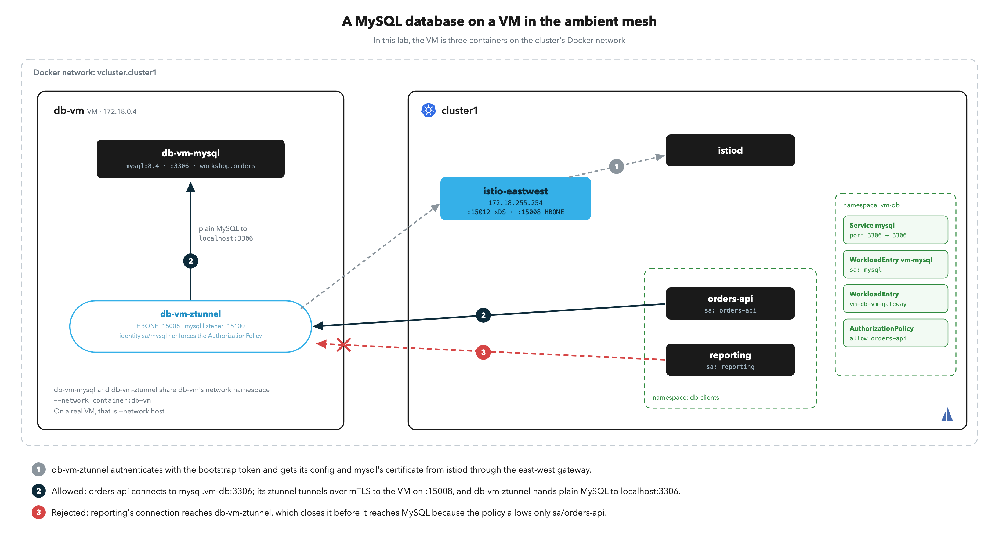

# Run a MySQL Database on a VM in the Mesh

# Objectives
- Onboard a MySQL database with seeded data on a VM into the ambient mesh, with its own SPIFFE identity
- Query the database from pods by its Kubernetes Service name over mTLS
- Encrypt and authenticate database traffic with the mesh's mTLS while MySQL's own TLS is off
- Allow one client and reject another with an identity-based `AuthorizationPolicy`

## Prerequisites
- This lab assumes you have completed labs `001`–`003`.
- A Docker-based local cluster (vind or KinD). As in lab `011`, the "VM" is a set of containers on the cluster's Docker network, and `docker exec` and bind mounts stand in for `ssh` and `scp`. On GKE or another cloud cluster, follow the [Solo docs for VMs](https://docs.solo.io/istio/1.30.x/ambient/setup/sample-apps/vm-integration/) with a real VM in the cluster's VPC instead, and skip this lab.
- `docker` CLI on your machine.

You can run this lab without lab `011`. If lab `011`'s resources are still running, leave them: this lab uses its own names.

Ensure the following environment variable is set:
```bash
export KUBECONTEXT_CLUSTER1=cluster1  # Replace with your actual kubectl context name
```

## Background

A database on a VM joins the ambient mesh the same way lab `011`'s echo app does: a ztunnel on the VM gets a certificate for the database's identity from istiod, accepts mesh traffic on HBONE port `15008`, and hands it to MySQL on localhost. Pods reach the database by a Kubernetes Service name, and policies select it like a pod. Lab `011` explains each part in more detail.

In this lab, the VM is three containers on the cluster's Docker network:

| Container | Plays the role of |
|---|---|
| `db-vm` | The VM itself: its network interface and IP |
| `db-vm-mysql` | MySQL `8.4` running on the VM, seeded with a `workshop.orders` table |
| `db-vm-ztunnel` | ztunnel running on the VM |

Two client pods in namespace `db-clients` query the database: `orders-api`, which the policy allows, and `reporting`, which it rejects.



## Prepare the mesh

If you completed lab `011`, these steps are already done, and running them again is safe.

The VM's ztunnel authenticates to istiod with a long-lived Kubernetes service account token that has no audience, and istiod rejects tokens like it by default. Setting `REQUIRE_3P_TOKEN=false` makes istiod accept them.

This relaxes one check: anyone holding a non-expiring service account token for a mesh identity can get a certificate for that identity until the token is deleted. Pods are unaffected, because they use expiring, audience-bound tokens. Keep this setting out of production clusters. It stays in place until lab `013` uninstalls Istio.

```bash
helm upgrade --kube-context $KUBECONTEXT_CLUSTER1 istiod oci://us-docker.pkg.dev/soloio-img/istio-helm/istiod \
  -n istio-system \
  --version 1.30.5-solo \
  --reuse-values \
  --set-string env.REQUIRE_3P_TOKEN=false

kubectl rollout status deploy/istiod -n istio-system --watch --timeout=90s --context $KUBECONTEXT_CLUSTER1
```

Create the east-west gateway. It exposes istiod (`15012`) and the cluster's HBONE port (`15008`) to workloads outside the cluster network:
```bash
kubectl create namespace istio-eastwest --context $KUBECONTEXT_CLUSTER1 --dry-run=client -o yaml | kubectl apply --context $KUBECONTEXT_CLUSTER1 -f -
./solo-istioctl multicluster expose --namespace istio-eastwest --generate --context $KUBECONTEXT_CLUSTER1 | kubectl apply --context $KUBECONTEXT_CLUSTER1 -f -
kubectl wait --for=condition=Programmed gateway/istio-eastwest -n istio-eastwest --timeout=120s --context $KUBECONTEXT_CLUSTER1
kubectl get gateway istio-eastwest -n istio-eastwest --context $KUBECONTEXT_CLUSTER1
```

Expected output (the address differs on your machine):
```
NAME             CLASS            ADDRESS          PROGRAMMED   AGE
istio-eastwest   istio-eastwest   172.18.255.254   True         1s
```

> **No address?** The gateway Service is type `LoadBalancer`. vind assigns one on the Docker network. On KinD, install [cloud-provider-kind](https://github.com/kubernetes-sigs/cloud-provider-kind) first.

## Start the VM

Find the Docker network your cluster's nodes are on:
```bash
NODE_IP=$(kubectl get nodes --context $KUBECONTEXT_CLUSTER1 -o jsonpath='{.items[0].status.addresses[?(@.type=="InternalIP")].address}')
export VM_DOCKER_NETWORK=""
for NET in $(docker network ls --format '{{.Name}}'); do
  docker network inspect "$NET" --format '{{range .Containers}}{{.IPv4Address}} {{end}}' | tr ' ' '\n' | grep -qx "$NODE_IP/[0-9]*" && VM_DOCKER_NETWORK=$NET
done
[ -n "$VM_DOCKER_NETWORK" ] && echo "Cluster Docker network: $VM_DOCKER_NETWORK" \
  || echo "⚠️  No Docker network contains node IP $NODE_IP. This lab needs a Docker-based cluster (vind or KinD). Set VM_DOCKER_NETWORK by hand if your nodes are containers."
```

The seed script creates database `workshop`, a table `orders` with five rows, and a read-only user `shop`:
```bash
cat vm/mysql/seed.sql
```

Start the VM and MySQL. MySQL runs every script in `/docker-entrypoint-initdb.d/` on its first start; on a real VM, you would `scp` the script over and run `mysql < seed.sql`. The passwords are workshop values:
```bash
if [ -z "$VM_DOCKER_NETWORK" ]; then
  echo "⚠️  VM_DOCKER_NETWORK is empty. Stop here: this lab needs a Docker-based cluster."
else
  docker rm -f -v db-vm-ztunnel db-vm-mysql db-vm 2>/dev/null
  docker run -d --name db-vm --hostname db-vm --network "$VM_DOCKER_NETWORK" nicolaka/netshoot sleep infinity
  docker run -d --name db-vm-mysql --network container:db-vm \
    -e MYSQL_ROOT_PASSWORD=workshop-root \
    -v "$PWD/vm/mysql/seed.sql:/docker-entrypoint-initdb.d/seed.sql:ro" \
    mysql:8.4

  export DB_VM_IP=$(docker inspect db-vm --format "{{(index .NetworkSettings.Networks \"$VM_DOCKER_NETWORK\").IPAddress}}")
  echo "DB VM IP: $DB_VM_IP"
fi
```

MySQL takes several seconds to initialize. Wait until the `shop` user can read the seeded table over TCP:
```bash
MYSQL_READY=""
for i in $(seq 1 60); do
  docker exec -e MYSQL_PWD=shop-pass db-vm-mysql \
    mysql -h127.0.0.1 -ushop -t -e 'SELECT COUNT(*) AS orders FROM workshop.orders' 2>/dev/null && { MYSQL_READY=yes; break; }
  sleep 2
done
[ -n "$MYSQL_READY" ] || echo "⚠️  MySQL did not become ready in 2 minutes. Check docker logs db-vm-mysql before you continue."
```

Expected output:
```
+--------+
| orders |
+--------+
|      5 |
+--------+
```

Check that the VM can reach istiod through the east-west gateway:
```bash
EW_ADDRESS=$(kubectl get gateway istio-eastwest -n istio-eastwest --context $KUBECONTEXT_CLUSTER1 -o jsonpath='{.status.addresses[0].value}')
docker exec db-vm nc -zv -w2 "$EW_ADDRESS" 15012
```

Expected output:
```
Connection to 172.18.255.254 15012 port [tcp/*] succeeded!
```

## Onboard the database

Create a namespace for the database and add it to the ambient mesh:
```bash
kubectl create namespace vm-db --context $KUBECONTEXT_CLUSTER1 --dry-run=client -o yaml | kubectl apply --context $KUBECONTEXT_CLUSTER1 -f -
kubectl label namespace vm-db istio.io/dataplane-mode=ambient --overwrite --context $KUBECONTEXT_CLUSTER1
```

Register MySQL as workload `mysql`. `--ports tcp:3306` creates a Service port `3306` that forwards to MySQL's port `3306` on the VM. `--hostname` must match the VM's hostname:
```bash
mkdir -p ./vm-db-tokens
DB_VM_IP=$(docker inspect db-vm --format '{{range .NetworkSettings.Networks}}{{.IPAddress}}{{end}}')
./solo-istioctl vm add-workload mysql \
  --external \
  --address "$DB_VM_IP" \
  --namespace vm-db \
  --ports tcp:3306 \
  --hostname db-vm \
  --output-dir ./vm-db-tokens \
  --context $KUBECONTEXT_CLUSTER1 | tee ./vm-db-tokens/add-workload.out
```

Expected output (abridged):
```
• Generated authentication token for vm-db/mysql
• Created WorkloadEntry vm-db/vm-mysql
• Created Service vm-db/mysql
• Created gateway WorkloadEntry vm-db/vm-db-vm-gateway
• Generating a bootstrap token for vm-db/vm-gateway...
  • Service "istio-eastwest" provides Istiod access on port 15012
...
Start ztunnel on the VM with:
  BOOTSTRAP_TOKEN=<token> ztunnel

• Wrote workload token to vm-db-tokens/mysql.token
```

The bootstrap token in the output and the workload token in `./vm-db-tokens/mysql.token` are credentials. Save the bootstrap token and put the workload token where ztunnel reads it, `/etc/ztunnel/tokens/<namespace>/<workload>/token`:
```bash
TOKEN=$(grep -o 'BOOTSTRAP_TOKEN=[^ ]*' ./vm-db-tokens/add-workload.out | head -1 | cut -d= -f2-)
[ -n "$TOKEN" ] && printf '%s' "$TOKEN" > ./vm-db-tokens/bootstrap.token
[ -s ./vm-db-tokens/bootstrap.token ] || echo "⚠️  No bootstrap token in the output. The VM gateway already existed, so add-workload did not generate one. Re-run the add-workload command with --bootstrap, then run this block again."

mkdir -p ./vm-db-config/tokens/vm-db/mysql
cp ./vm-db-tokens/mysql.token ./vm-db-config/tokens/vm-db/mysql/token
```

Start ztunnel on the VM:
```bash
docker rm -f db-vm-ztunnel 2>/dev/null
docker run -d --name db-vm-ztunnel \
  --network container:db-vm \
  -e HOSTNAME=db-vm \
  -e BOOTSTRAP_TOKEN="$(cat ./vm-db-tokens/bootstrap.token)" \
  -v "$PWD/vm-db-config:/etc/ztunnel:ro" \
  us-docker.pkg.dev/soloio-img/istio/ztunnel:1.30.5-solo-distroless
```

Check that ztunnel connected to istiod, accepted the license, and provisioned a listener for `mysql`:
```bash
sleep 5
docker logs db-vm-ztunnel 2>&1 | grep -E 'detected license|proxying to XDS|provisioned inbound listener'
```

Expected output:
```
... info  xds::client:xds{id=1}  detected license  state=OK
... info  proxy::gateway  proxying to XDS server  xds_address="172.18.255.254:15012"
... info  proxy::gateway::xds_workload_provisioner  provisioned inbound listener for XDS workload  component="xds-workload-provisioner" port=15100 workload=vm-db/mysql
```

Look at what `add-workload` created, and at the mesh's view of it:
```bash
kubectl get workloadentry,svc -n vm-db --context $KUBECONTEXT_CLUSTER1
./solo-istioctl ztunnel-config workloads --context $KUBECONTEXT_CLUSTER1 | grep -E 'NAMESPACE|vm-db'
./solo-istioctl ztunnel-config services --context $KUBECONTEXT_CLUSTER1 | grep -E 'NAMESPACE|vm-db'
```

Expected output (abridged):
```
NAME                                                 AGE   ADDRESS
workloadentry.networking.istio.io/vm-db-vm-gateway   36s   172.18.0.4
workloadentry.networking.istio.io/vm-mysql           36s   127.0.0.1

NAME            TYPE        CLUSTER-IP       EXTERNAL-IP   PORT(S)    AGE
service/mysql   ClusterIP   10.111.189.194   <none>        3306/TCP   36s

NAMESPACE  POD NAME          ADDRESS     NODE   WAYPOINT PROTOCOL NETWORK  NETWORK GATEWAY
vm-db      vm-db-vm-gateway  172.18.0.4  db-vm  None     HBONE    cluster1 cluster1/172.18.255.254
vm-db      vm-mysql          127.0.0.1   db-vm  None     HBONE    cluster1 cluster1/172.18.0.4

NAMESPACE  SERVICE NAME  SERVICE VIP     WAYPOINT ENDPOINTS
vm-db      mysql         10.111.189.194  None     1/1
```

`vm-mysql` has address `127.0.0.1` and the VM's IP as its network gateway: the mesh tunnels to the VM, and the VM's ztunnel delivers to MySQL on localhost.

## Query the database from the mesh

Deploy the two clients. Each is a pod with the MySQL CLI and its own service account:
```bash
kubectl apply -f vm/mysql/db-clients.yaml --context $KUBECONTEXT_CLUSTER1
kubectl rollout status deploy/orders-api -n db-clients --timeout=180s --context $KUBECONTEXT_CLUSTER1
kubectl rollout status deploy/reporting -n db-clients --timeout=180s --context $KUBECONTEXT_CLUSTER1
```

Query the orders from `orders-api` by the Service name `mysql.vm-db`. `--ssl-mode=DISABLED` turns off MySQL's own TLS, which MySQL 8 enables by default with self-signed certificates. `--get-server-public-key` lets the `shop` user log in with MySQL's default `caching_sha2_password` method over a plain-text MySQL connection:
```bash
kubectl exec deploy/orders-api -n db-clients --context $KUBECONTEXT_CLUSTER1 -- \
  env MYSQL_PWD=shop-pass mysql -h mysql.vm-db -ushop --ssl-mode=DISABLED --get-server-public-key -t \
  -e "SELECT id, customer, item, qty FROM workshop.orders; SHOW STATUS LIKE 'Ssl_cipher';"
```

Expected output:
```
+----+----------+---------+-----+
| id | customer | item    | qty |
+----+----------+---------+-----+
|  1 | acme     | widget  |  12 |
|  2 | globex   | gear    |   3 |
|  3 | initech  | stapler |   1 |
|  4 | umbrella | sensor  |  40 |
|  5 | hooli    | server  |   2 |
+----+----------+---------+-----+
+---------------+-------+
| Variable_name | Value |
+---------------+-------+
| Ssl_cipher    |       |
+---------------+-------+
```

The VM's ztunnel logged the connection with both identities:
```bash
docker logs db-vm-ztunnel --since 1m 2>&1 | grep 'direction="inbound"' | tail -1
```

Expected output (abridged):
```
... src.identity="spiffe://cluster1.local/ns/db-clients/sa/orders-api" dst.addr=127.0.0.1:15100 dst.hbone_addr=mysql.vm-db.svc.cluster.local:3306 dst.service="mysql.vm-db.svc.cluster.local" dst.workload="vm-mysql" ... dst.identity="spiffe://cluster1.local/ns/vm-db/sa/mysql" ... direction="inbound" ...
```

## mTLS without database TLS

The empty `Ssl_cipher` shows that the MySQL session is plain text. The hop between the pod and the VM still ran over mTLS: the pod's node ztunnel tunnelled the session to the VM on port `15008`, and the VM's ztunnel terminated mTLS as `mysql` on its listener `15100`, verified the caller as `orders-api`, and passed the session to MySQL on localhost. The two ztunnels held the certificates, and MySQL and the client ran with TLS off.

The mesh decides which workload identities can open a connection to the database. MySQL users and grants still decide who can log in and what they can read.

## Restrict access by identity

With no policy, any workload in the mesh can connect. `reporting` reads the orders too:
```bash
kubectl exec deploy/reporting -n db-clients --context $KUBECONTEXT_CLUSTER1 -- \
  env MYSQL_PWD=shop-pass mysql -h mysql.vm-db -ushop --ssl-mode=DISABLED --get-server-public-key -t \
  -e "SELECT COUNT(*) AS orders FROM workshop.orders;"
```

Expected output:
```
+--------+
| orders |
+--------+
|      5 |
+--------+
```

`add-workload` labels the `WorkloadEntry` with `vm.solo.io/workload: mysql`. The policy selects that label and allows only `orders-api`'s service account. It is an L4 policy, so the VM's ztunnel enforces it by itself:
```bash
cat vm/mysql/mysql-allow-orders-api.yaml
kubectl apply -f vm/mysql/mysql-allow-orders-api.yaml --context $KUBECONTEXT_CLUSTER1
```

Query from `orders-api` (allowed) and from `reporting` (not allowed):
```bash
sleep 3
kubectl exec deploy/orders-api -n db-clients --context $KUBECONTEXT_CLUSTER1 -- \
  env MYSQL_PWD=shop-pass mysql -h mysql.vm-db -ushop --ssl-mode=DISABLED --get-server-public-key -t \
  -e "SELECT COUNT(*) AS orders FROM workshop.orders;"
kubectl exec deploy/reporting -n db-clients --context $KUBECONTEXT_CLUSTER1 -- \
  env MYSQL_PWD=shop-pass mysql -h mysql.vm-db -ushop --ssl-mode=DISABLED --get-server-public-key -t \
  --connect-timeout=5 -e "SELECT COUNT(*) AS orders FROM workshop.orders;"
```

Expected output:
```
+--------+
| orders |
+--------+
|      5 |
+--------+
ERROR 2013 (HY000): Lost connection to MySQL server at 'reading initial communication packet', system error: 0
command terminated with exit code 1
```

`reporting` lost the connection during the MySQL handshake: the VM's ztunnel closed it before handing any bytes to MySQL. The ztunnel logged why:
```bash
docker logs db-vm-ztunnel --since 1m 2>&1 | grep 'policy rejection' | tail -1
```

Expected output (abridged):
```
... error  access  connection complete  ... src.identity="spiffe://cluster1.local/ns/db-clients/sa/reporting" ... dst.workload="vm-mysql" ... bytes_sent=0 bytes_recv=0 ... error="connection closed due to policy rejection: allow policies exist, but none allowed"
```

## Going further
- On a real VM, replace `docker exec db-vm` with `ssh`, the bind mounts with `scp` to `/etc/ztunnel` and the MySQL init directory, and `--network container:db-vm` with `--network host`.

## Cleanup

Stop the VM's containers and delete the tokens:
```bash
docker rm -f -v db-vm-ztunnel db-vm-mysql db-vm 2>/dev/null
rm -rf ./vm-db-tokens ./vm-db-config
```

Remove the database and client namespaces:
```bash
kubectl delete namespace vm-db db-clients --context $KUBECONTEXT_CLUSTER1 --ignore-not-found
```

This leaves the east-west gateway in `istio-eastwest`, which lab `011` also uses. istiod keeps `REQUIRE_3P_TOKEN=false` until you uninstall Istio. If you would like to clean up all workshop resources, see `013` for cleanup instructions.
